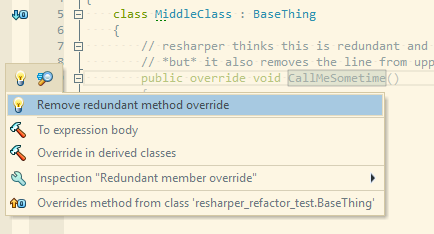
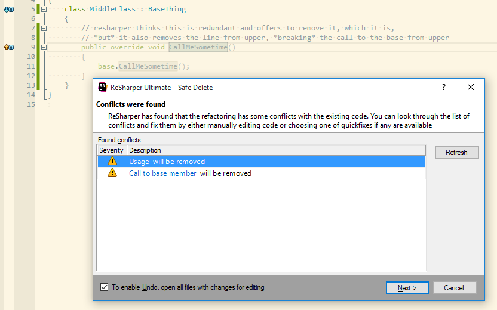

# wuh?

This repo explores how resharper will break code at runtime by
over-enthusiastically stripping out references to a redundant override of a
base method.

Take a look at the various branches to see it in various states.

## branch: prepared

All tests green, with a redundant override in the middle class in the
hierarchy.

## branch: broken

Applied the refactor suggested by resharper. Note there was no option to not remove usages.

Tests middle & upper now fail because resharper did two things wrong:

1. It removed the call in the upper class's override to the base method,
   meaning that calls to upper's method now fail to invoke the base method.
2. It removed the call from the tests to the middle method, even though it was
   still valid because the base class has a method of the same name, and the
   middle method used to delegate to it.

## branch: repaired

Patched up what resharper did, so you can see how to fix it.

## branch: do-it-yourself

Based on `prepared` branch, just deletes the redundant method without bothering
to use the broken resharper tool

# so?

I'm actually pretty surprised because for me resharper has always been
rock-solid with refactorings.

Resharper version info:

    JetBrains ReSharper Ultimate 2016.1.2  Build 105.0.20160522.80219
    ReSharper 2016.1.20160523.141907
